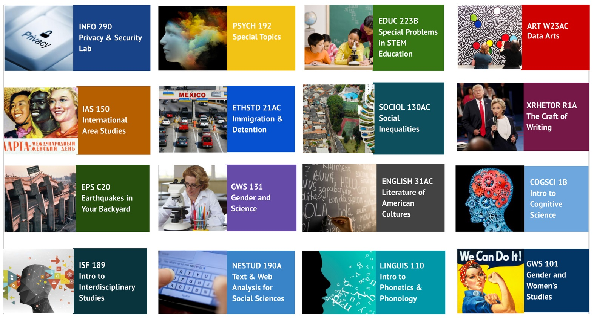

# What is a Data Science Module?

A Data Science Module is a short exploration of data science designed to fit into an existing course. Modules give non-data-science students the opportunity to explore data-driven methods in familiar domains.

Each module is designed by a team of DSEP curriculum developers, working closely with the course instructor, and may be taught by either the DSEP team or the instructors themselves.

<!-- add modules textbook link instead below? -->

An overview page is available [here](https://ds-modules.github.io/DS-Modules/).

### Prerequisites

Data science modules can be used in all types of subjects and skill levels- no extra prerequisites required! Each module is designed to meet students where they are. Any necessary coding skills or statistical concepts are highly targeted towards the goals of the course and taught during the module itself.

### Module structure

Because modules are designed to integrate into current course material, every module looks different. A module often is presented as an interactive lecture or lab. Led by either course instructors or a modules team developer, students can write and execute code, make visualizations, and process data in real time. Modules may also include take-home coding, computation, or critical thinking assignments. A module can take up a single class or discussion period, or they may be spread out over a few weeks.

A few logistical concerns to consider are module timing and length. For example, a module scheduled during midterms might fit the schedule of the course, but not of the students. And, if part of the course is modularized, that may mean that homeworks or exams should also be modularized.

## Previous Data Science Modules:

In the past, modules have been taught to everyone from freshmen with no coding or statistics experience to seniors taking upper-division econometrics. To date, DSEP modules have been made for courses in:

* Sociology
* Legal Studies
* Economics
* Psychology
* Information Studies
* Medieval Studies
* Rhetoric
* Gender and Women’s Studies
* Linguistics
* Education

You can browse past module materials on the [program’s Github page](https://github.com/ds-modules).
